# 👋 Hi there!

  

---

## 🚀 About Me

I am a student and developer passionate about creating efficient, keyboard-centric workflows.

* 🐍 **Main Language:** Python
* 💻 **Setup:** MacBook Air M4 + Yabai + Skhd
* 📝 **Editor:** Neovim/Zed

---

## 🛠️ Tech Stack

  

---

## 📁 Featured Projects

  
  

---

## 📊 GitHub Stats

  
  

  

  

